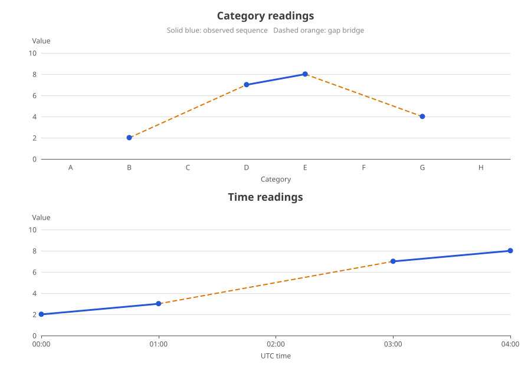

# Chart gaps

Show missing-data connections as dashed lines while keeping measured segments solid. This copyable TypeScript adapter handles explicit `null` values, omitted categories and omitted time samples. It never invents a measurement or substitutes zero for missing data.



The core has no runtime dependencies. The included integration fixture uses ECharts **6.1.0** and straight Cartesian line series. This is an independent adapter, available under the [MIT license](LICENSE).

## Download and check

[Download source and tests v0.1.0](../../downloads/chart-gaps-v0.1.0.zip?raw=true), extract the archive, and open a terminal in `chart-gaps`:

```sh
npm ci --ignore-scripts
npm test
npm run preview
```

The fixture is verified with Node.js 24.19.0 and TypeScript 5.9.3. `npm test` compiles the module and runs unit tests plus actual ECharts SVG rendering checks. `npm run preview` regenerates the image above. You can copy [`gap-lines.ts`](gap-lines.ts) into a TypeScript application; the core does not import ECharts. There is no package-name installation on npm.

## Categories, including omitted entries

Provide the complete category order and the available samples. Samples may arrive in a different order; omitted categories and explicit `null` values both create gaps. In this example, only B, D, E and G have measurements. The real D–E segment stays solid; B–D and E–G are dashed; A and H are not extrapolated.

```ts
import type { EChartsOption } from 'echarts';
import { splitCategoryGaps } from './gap-lines.js';

const categories = ['A', 'B', 'C', 'D', 'E', 'F', 'G', 'H'];
const data = splitCategoryGaps(categories, [
  ['G', 4], ['B', 2], ['E', 8], ['D', 7],
]);

export const option: EChartsOption = {
  animation: false,
  legend: { data: ['Measured'] },
  xAxis: { type: 'category', data: categories },
  yAxis: { type: 'value' },
  series: [
    {
      name: 'Measured', type: 'line', data: data.solid,
      connectNulls: false, showAllSymbol: true,
      lineStyle: { color: '#2563eb' }, itemStyle: { color: '#2563eb' },
    },
    {
      name: 'Measured', type: 'line', data: data.bridges,
      connectNulls: false, showSymbol: false, silent: true,
      tooltip: { show: false },
      lineStyle: { color: '#2563eb', type: 'dashed' },
    },
  ],
};
```

Pass `option` to your ECharts instance with `chart.setOption(option)`. The shared series name lets the legend toggle both layers. The second series draws only measured endpoints across gaps; null separators stop it from connecting separate gaps.

## Time samples with an explicit interval limit

Use strictly increasing integer epoch milliseconds and set the largest normal interval for your data. A larger separation creates a gap even if the missing timestamp is absent from the input. Equality with the limit remains continuous. For irregular sampling, choose the threshold from the meaning of your data; the adapter does not guess a schedule.

```ts
import type { EChartsOption } from 'echarts';
import { splitTimeGaps } from './gap-lines.js';

const start = Date.UTC(2026, 0, 1);
const data = splitTimeGaps([
  [start, 2],
  [start + 1000, 3],
  [start + 3000, 7],
  [start + 4000, null],
  [start + 5000, 4],
  [start + 6000, 5],
], 1000);

export const option: EChartsOption = {
  animation: false,
  useUTC: true,
  legend: { data: ['Measured'] },
  xAxis: { type: 'time' },
  yAxis: { type: 'value' },
  series: [
    {
      name: 'Measured', type: 'line', data: data.solid,
      connectNulls: false, showAllSymbol: true,
      lineStyle: { color: '#2563eb' }, itemStyle: { color: '#2563eb' },
    },
    {
      name: 'Measured', type: 'line', data: data.bridges,
      connectNulls: false, showSymbol: false, silent: true,
      tooltip: { show: false },
      lineStyle: { color: '#2563eb', type: 'dashed' },
    },
  ],
};
```

The missing 2-second sample creates one bridge. The explicit null at 4 seconds creates another. A long missing span adds only one drawing separator, without allocating an entry for every absent timestamp.

## Return value and validation

Both functions return `{ solid, bridges, gapCount }`. Each point is `[x, y]`; `y` is a finite number or `null`. Category x values are zero-based positions in your category array. Time x values are epoch milliseconds. Input arrays and tuples are not mutated, and returned tuples are independent copies.

`solid` retains supplied measurements and breaks around missing data. For an omitted time interval it includes a midpoint with null y, solely to break the line; this midpoint may be fractional. `bridges` contains each pair of measured gap endpoints followed by a null separator. `gapCount` counts interior gaps, including a combined run of absent and explicit-null samples as one gap. Leading/trailing missing values, a single measured point and all-null inputs produce no extrapolated bridge.

The functions reject malformed inputs instead of coercing them:

- Categories must be unique strings. Every sample must name a known category, at most once.
- Time samples must be strictly increasing integer epoch milliseconds within ±8,640,000,000,000,000. The interval limit must be a positive safe integer, including for empty input.
- Samples must be dense arrays of two-element tuples. Missing tuple values, `undefined`, `NaN`, infinity and wrong runtime types are rejected. Use explicit `null` for an unknown value; zero remains a measurement.

Type or shape errors throw `TypeError`; duplicates, unknown categories, invalid order or numeric range errors throw `RangeError`. Empty arrays are supported. Category preparation takes O(categories + samples), time preparation O(samples), with output bounded by input size and the number of gaps.

## Integration limits

Use straight, unstacked line series with `connectNulls: false` and no sampling. Curved lines, stacked areas, sampling and dataZoom behavior are outside this fixture's verification. Interactive tooltips are not verified; the examples leave tooltips disabled and suppress them on the drawing layer. If you add tooltips or export chart data, use your original measurements as the source rather than treating drawing separators as additional samples.

The virtual connections indicate a gap, not an estimate of intermediate values. The adapter does not recover missing measurements, infer a time cadence, or replace ECharts' internal behavior.

## Why this example exists

Developers have requested distinct missing-data connections and detection of omitted points in [ECharts issue #9220](https://github.com/apache/echarts/issues/9220). The discussion includes an overlay workaround; this example supplies a reusable alternative that preserves missing values and draws only the gap segments. It is not an upstream patch or an endorsement by the ECharts project.

The tests verify both category and time axes using ECharts' actual SVG renderer, including disconnected solid paths, dashed gap paths and their endpoint coordinates. They also cover validation, explicit nulls, omitted samples, interval equality, boundary gaps, zero/negative values and independent output tuples.

## Buy me a coffee, if this helped

This code is free to use, modify and share. If it saved you some time and you feel like buying me a coffee, a small contribution is welcome. There is no obligation; feedback and useful examples are appreciated too.

- **USDC / SOL · Solana:** `9tY6D9mwcFaJwwzEHvw2v7nhSpdjqjNBYtuooyBN6rYy`
- **USDC / ETH · Base:** `0x568Ab98578d682FB0B0b45619BE73EbFfbf5a6eA`
- **USDT · BNB Smart Chain (BEP20):** `0x568Ab98578d682FB0B0b45619BE73EbFfbf5a6eA`
