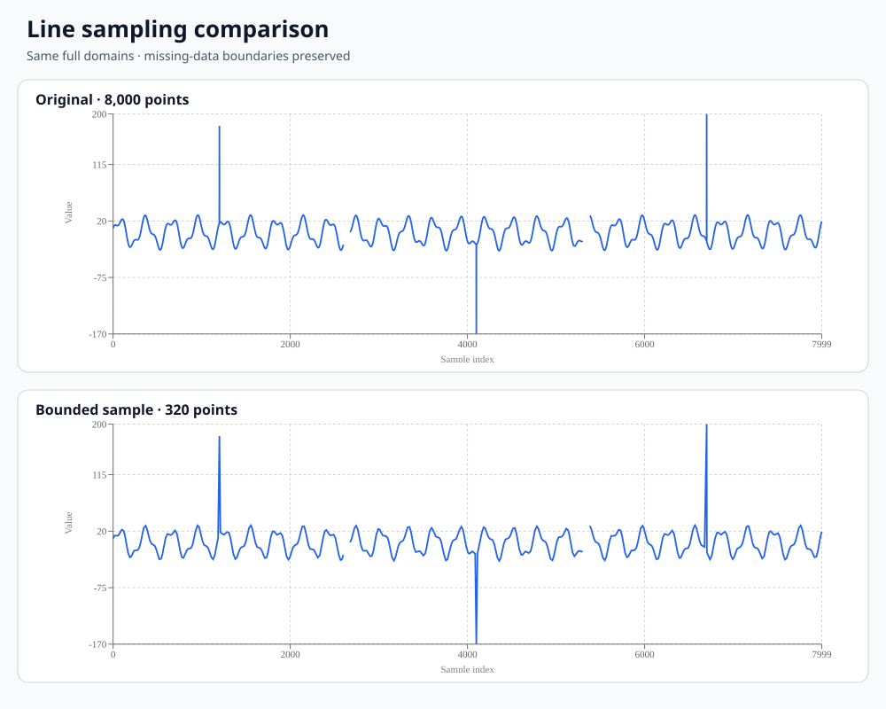

# Line sampling

Reduce the points passed to a line chart while keeping missing-data boundaries. This free TypeScript helper applies Largest Triangle Three Buckets (LTTB) separately to each continuous run, shares one point budget across the runs, and returns the original records with their source indices. A React component connects it to Recharts.

[Download source, tests and example](../../downloads/line-sampling-v0.1.0.zip?raw=true) · [Open the SVG comparison](../../downloads/line-sampling-preview.svg?raw=true)



The example contains 8,000 synthetic rows, including two missing intervals. A budget of 320 keeps 316 measured points and four null boundary markers; both charts have three continuous line segments. This input needs a budget of at least 10 to retain all run boundaries. This demonstrates fewer rendered vertices with preserved breaks. It is not a frame-rate benchmark.

## Copy the core

Copy `sample-line.ts` into your project. It has no runtime dependencies and works in Node or a browser after TypeScript compilation. For example:

```ts
import { sampleLine, PointBudgetError } from './sample-line.js';

const readings = [0, 2, 9, 2, 0, 3, 7, 1, 4, 0].map((y, x) => ({
  x, y, label: `Reading ${x}`,
}));

try {
  const result = sampleLine(readings, {
    x: (row) => row.x,
    y: (row) => row.y,
    maxPoints: 6,
  });
  console.log(result.indices); // [0, 2, 4, 6, 7, 9]
  console.log(result.data[1] === readings[2]); // true
} catch (error) {
  if (error instanceof PointBudgetError) {
    console.error(`Use at least ${error.requiredPoints} points to keep every break.`);
  } else {
    throw error;
  }
}
```

The `.js` import targets TypeScript's emitted file. Use the import convention required by your application's compiler or bundler.

## Add the React component

Copy `sample-line.ts` and `SampledLineChart.tsx` into your React application. The component expects numeric `x` and numeric-or-null `y` fields; additional fields stay attached to their original records.

```tsx
import { SampledLineChart } from './SampledLineChart.js';

const readings = [
  { x: 0, y: 2 }, { x: 1, y: 5 }, { x: 2, y: 3 },
  { x: 3, y: null }, { x: 4, y: null },
  { x: 5, y: 7 }, { x: 6, y: 4 }, { x: 7, y: 6 },
];

export function ReadingsChart() {
  return (
    <SampledLineChart
      data={readings}
      maxPoints={7}
      width={720}
      height={320}
      title="Sampled readings"
      xLabel="Sample"
      yLabel="Value"
    />
  );
}
```

This fixture uses React / React DOM / React Is 19.3.0 and Recharts 3.10.1. Match React Is to your React version when integrating into an existing app. The component memoizes by data-array identity and budget: replace the array when changing records. It uses fixed numeric dimensions; your application can measure its container and pass those dimensions.

The line is linear, with `connectNulls={false}`, `dot={false}` and `isAnimationActive={false}`. Its numeric axes use the full original data's domains, so removing a point does not rescale the chart around the remaining samples. Tooltips only have the selected records. The React chart mounts in a browser; this example does not provide server-rendered Recharts charts.

## Input, output and budget rules

`sampleLine(data, { x, y, maxPoints })` accepts a dense readonly array. Both selectors receive the original row and its original index, exactly once each on a valid input. Keep selectors pure. `x` must return finite numbers in nondecreasing order; equal values are allowed. `y` must return a finite number or `null`. Convert dates, sort data and normalize other missing markers before calling the helper; it does not coerce strings or silently sort.

`maxPoints` is a safe integer of at least 2. Options must be a plain or null-prototype object with exactly those three own keys. Wrong types or shapes throw `TypeError`; invalid numeric ranges, nonfinite coordinates and descending x throw `RangeError`. Selector errors propagate. Validation also runs when the input already fits the budget.

The result contains:

| Field | Meaning |
| --- | --- |
| `data` | New readonly array containing selected original records |
| `indices` | Corresponding indices in the original input, in increasing order |
| `sourceCount` | Original number of rows |
| `minimumPoints` | Minimum budget needed to preserve every finite/null run's endpoints |

The result and its two arrays are frozen. Caller-owned records are neither cloned nor frozen. Empty input returns empty arrays; if the input fits the budget, every row is retained.

During reduction, each continuous measured run keeps its first and last point, and each consecutive null run keeps its first and last marker. Single-row runs need only one point. Remaining slots are shared in proportion to the measured runs' interior sizes, using largest remainders with earlier-run tie breaking; LTTB selects the interiors. Equal triangle areas select the earliest candidate.

If mandatory boundaries exceed the cap, `PointBudgetError` exposes `requiredPoints` and `maxPoints`. Increase the budget or change your explicit missing-data policy. The helper never removes a break to make the data fit. The cap is a maximum: an all-null input may reduce to just two markers even with a larger budget.

## Reproduce the comparison and checks

Extract the ZIP, enter `line-sampling`, and use Node 24.19.0 or a compatible version supported by the pinned JSDOM dependency:

```sh
npm ci --ignore-scripts
npm test
npm run example
```

The build emits JavaScript and declarations into `dist/`. The example mounts the actual React component with React DOM in JSDOM and writes `output/preview.svg` and `output/summary.json`. No remote assets are fetched by the renderer. Tests cover hand-calculated LTTB cases, budget allocation, invalid inputs, missing intervals, immutability, TypeScript consumers and actual Recharts SVG paths, including updated props.

## Limits and background

LTTB is a visual approximation. It does not guarantee every peak, minimum, maximum, integral or statistical property. Use full-resolution data for analysis, export and exact lookup. Sampling one y field does not preserve the shape of other series; sample them separately. This helper does not implement viewport queries, zoom-aware resampling or streaming updates.

The core takes O(n + r log r) time and O(n) extra memory for n rows and r runs. It still reads every row, so it does not eliminate preprocessing cost. Per-run coordinate normalization avoids area overflow for large finite values; extreme floating-point rounding and the chart library's axis arithmetic remain limitations.

The [Recharts discussion](https://github.com/recharts/recharts/issues/1356) asks how to preprocess large line datasets. The [official Line API](https://recharts.github.io/en-US/api/Line/) documents the rendering controls used here. The [d3fc sampling reference](https://github.com/d3fc/d3fc/tree/master/packages/d3fc-sample) explains LTTB's previous-point / candidate / next-bucket-average construction. This is an independent implementation and example, with no affiliation to those projects.

## License

[MIT](LICENSE). Use, modify and share it, retaining the license notice.

## Buy me a coffee, if this helped

This code and guide are free. If they saved you some time and you would like to buy me a coffee, a small contribution is welcome, entirely optional. Feedback or a useful example is appreciated just as much.

- **USDC / SOL · Solana:** `9tY6D9mwcFaJwwzEHvw2v7nhSpdjqjNBYtuooyBN6rYy`
- **USDC / ETH · Base:** `0x568Ab98578d682FB0B0b45619BE73EbFfbf5a6eA`
- **USDT · BNB Smart Chain (BEP20):** `0x568Ab98578d682FB0B0b45619BE73EbFfbf5a6eA`

Please use the asset and network shown on the same line. Thank you for considering it.
